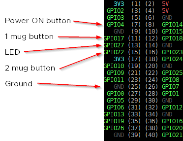
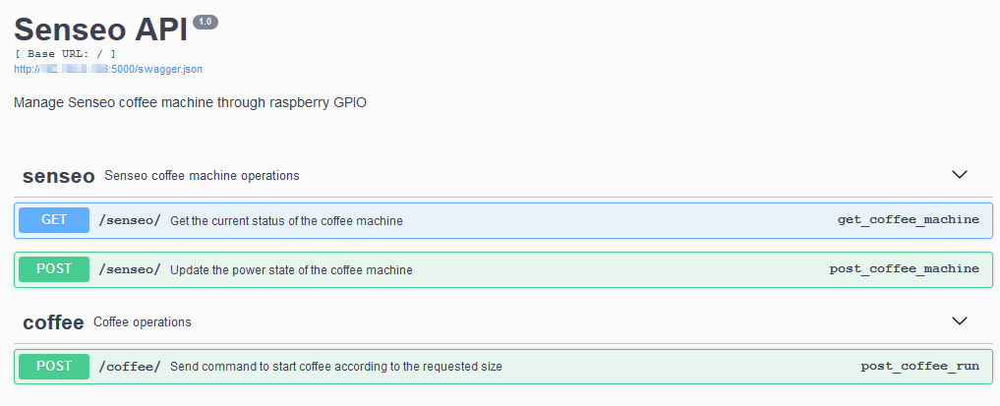

# Senseo APi

[](https://travis-ci.org/lrivallain/Senseo-aPi)

This module aims to provide a simple way to manage a Senseo Coffee machine through a Raspberry Pi's GPIO and a REST API.

The possible use case is to plug the Senseo machine to a Raspberry Pi µ-computer by using its GPIO and to
remotely use the REST API to start/stop the machine, and, to start a coffee production.

> **Note:** This setup is mainly for **fun** usage as it does not manage the water or coffee dose filling.

## Installation proccess

Download sources, unzip, goes to sources-folder.

### Installation

Use the `setup.py` using PIP:

```bash
pip install .
```

### Configuration

Prepare configuration files in your home dir:

```bash
mkdir -p ~/.senseo-api
cp ./logging.json ~/.senseo-api/
cp ./senseo_config.json ~/.senseo-api/
```

The content of the `senseo_config.json` **must** be customized depending on the GPIO PIN setup you want to use.

For example:



```json
{
  "1_mug_button": 17,
  "2_mug_button": 22,
  "led":          27,
  "power_button": 4
}
```

*Ground* is not setup as you can use any of the available `GND` of your GPIO board to plug it.

You can use the `pinout` command of `gpiozero` (as explained here [raspberrypi.org](https://www.raspberrypi.org/documentation/usage/gpio/)) to get the current GPIO PIN numbers:

```bash
sudo pip install gpiozero
pinout
```

Or the useful [pinout.xyz](https://pinout.xyz/#) web site.

## Usage

### Senseo API

The senseo API use the `flask`/`flask_restplus` module to provide API and Swagger documentation.

To run the developpement server:

```bash
senseo-api
```

Join the `http://<your_IP_address>:5000` URL to get the swagger interface:



### Senseo Simulator

A quick&dirty machine simulator is available in the package with the command `senseo-simulator`:

```bash
senseo-simulator --help
Usage: senseo-simulator [OPTIONS] COMMAND [ARGS]...

  Execute the Senseo Simulator

Options:
  --help  Show this message and exit.

Commands:
  heat  Simulate a ready coffee machine
  off   Simulate a power off action
  on    Simulate a power on action
  read  Read the values on the buttons
```

> **Warning:** If you want to use the simulator with `read` commande, run it before the `senseo-api`. If needed to restart it, stop `senseo-api`, run the simulator, start the `senseo-api` again.

## Trademark

*Senseo* is a registered trademark of *Philips* and *Douwe Egberts*.